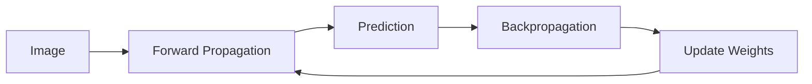

# AI Projects

This repository is where I keep the AI projects I make while learning Python and machine learning.

## Projects

| Project                     | Description                                                | Result             |
| --------------------------- | ---------------------------------------------------------- | ------------------ |
| Neural Network From Scratch | A simple neural network that recognizes handwritten digits | About 84% accuracy |
| More projects               | I will add more AI projects as I learn                     | In progress        |

---

## Neural Network From Scratch

I followed this tutorial:

https://www.youtube.com/watch?v=w8yWXqWQYmU

I built a small neural network using Python and NumPy. It looks at handwritten digit images and predicts a number from 0 to 9.

### Project details

| Item                | Value                   |
| ------------------- | ----------------------- |
| Dataset             | Kaggle Digit Recognizer |
| Image size          | 28 × 28 pixels          |
| Training iterations | 500                     |
| Learning rate       | 0.10                    |
| Final accuracy      | About 84%               |

### How it works

### What I learned

1. How weights and biases help a neural network make predictions.
2. How forward propagation sends data through the network.
3. How backpropagation finds mistakes.
4. How gradient descent improves the model.
5. How normalizing pixels helps training.
6. How to fix Python and NumPy errors.

### Problems I fixed

| Problem                     | Fix                                     |
| --------------------------- | --------------------------------------- |
| Pixel values were too large | Divided them by 255                     |
| Softmax overflow            | Used a safer softmax calculation        |
| Missing return statement    | Returned the forward propagation values |
| `np.arrange` error          | Changed it to `np.arange`               |
| Wrong function name         | Used `back_prop` everywhere             |
| Wrong array axis            | Changed axis 2 to axis 1                |

### Future improvements

* Test the model on new images
* Show correct and incorrect predictions
* Add an accuracy graph
* Try more hidden neurons
* Rebuild it with PyTorch

---

## Tools I Am Learning

* Python
* NumPy
* Pandas
* Matplotlib
* Kaggle
* Machine learning
