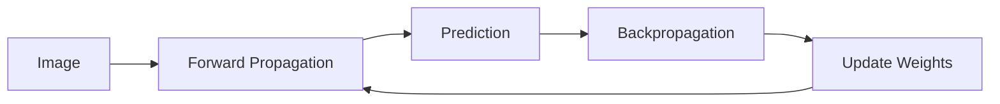
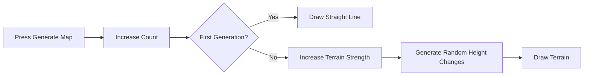
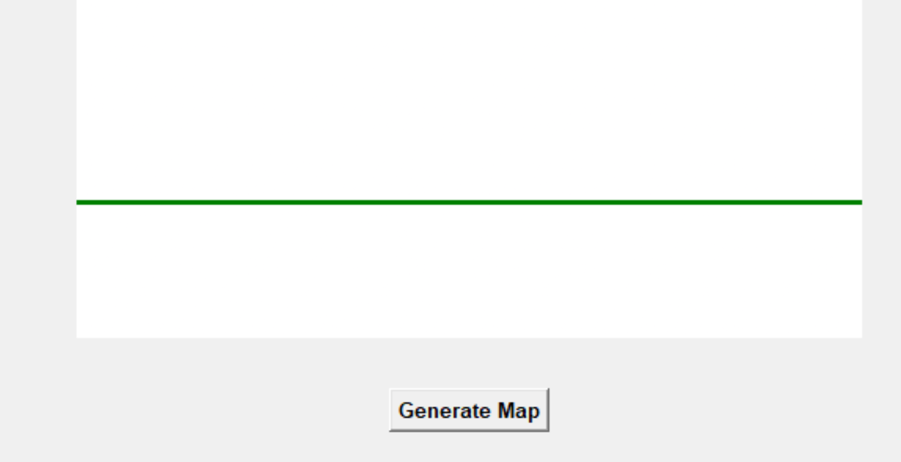
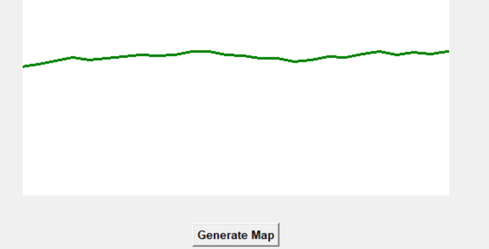
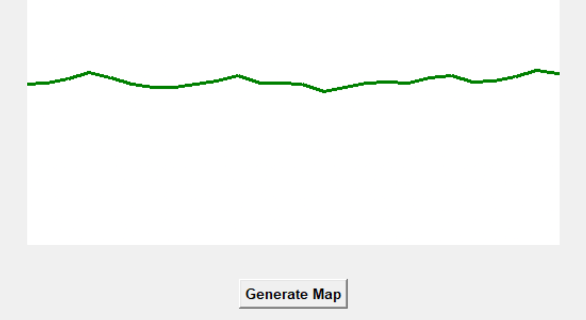
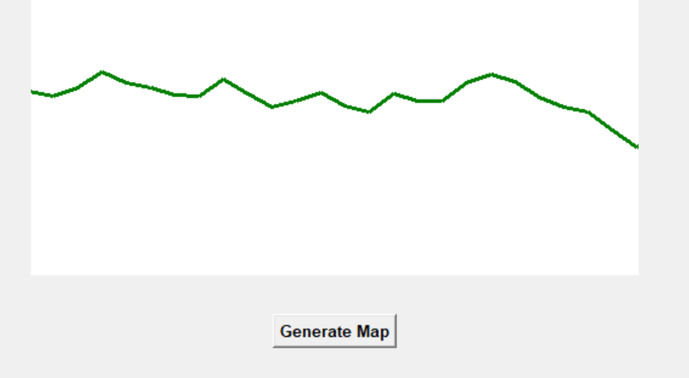

# AI Projects

This repository is where I keep the AI projects I make while learning Python and machine learning.

## Projects

| Project | Description | Result |
| --- | --- | --- |
| Neural Network From Scratch | A simple neural network that recognizes handwritten digits | About 84% accuracy |
| Procedural Terrain Generator | A program that generates terrain with increasing variation | Working |
| More projects | I will add more AI projects as I learn | In progress |

---

## Neural Network From Scratch

I followed this tutorial:

https://www.youtube.com/watch?v=w8yWXqWQYmU

I built a small neural network using Python and NumPy. It looks at handwritten digit images and predicts a number from 0 to 9.

### Project details

| Item | Value |
| --- | --- |
| Dataset | Kaggle Digit Recognizer |
| Image size | 28 × 28 pixels |
| Training iterations | 500 |
| Learning rate | 0.10 |
| Final accuracy | About 84% |

### How it works



### What I learned

1. How weights and biases help a neural network make predictions.
2. How forward propagation sends data through the network.
3. How backpropagation finds mistakes.
4. How gradient descent improves the model.
5. How normalizing pixels helps training.
6. How to fix Python and NumPy errors.

### Problems I fixed

| Problem | Fix |
| --- | --- |
| Pixel values were too large | Divided them by 255 |
| Softmax overflow | Used a safer softmax calculation |
| Missing return statement | Returned the forward propagation values |
| `np.arrange` error | Changed it to `np.arange` |
| Wrong function name | Used `back_prop` everywhere |
| Wrong array axis | Changed axis 2 to axis 1 |

### Future improvements

- Test the model on new images
- Show correct and incorrect predictions
- Add an accuracy graph
- Try more hidden neurons
- Rebuild it with PyTorch

---

## Procedural Terrain Generator

I built a procedural terrain generator using Python, Tkinter, and the random module.

The first time I press the **Generate Map** button, the program creates a straight line. Each time I press the button again, the terrain becomes more varied.

This represents how a generation system can start with a basic output and gradually create more detailed results.

This project is not a trained AI model yet. It is a procedural generation simulation that helped me understand state, controlled randomness, and how an output can change over multiple generations.

### Project details

| Item | Value |
| --- | --- |
| Language | Python |
| Interface | Tkinter |
| Generation method | Random height changes |
| First generation | Straight line |
| Later generations | Increasingly varied terrain |
| State tracking | Button press counter |
| Terrain boundaries | Between `y = 50` and `y = 250` |

### How it works



### Generation results

#### Generation 1: Straight line



#### Generation 2: Small terrain changes



#### Generation 3: More terrain variation



#### Generation 4: Stronger terrain variation



### Code

```python
import tkinter as tk
import random

root = tk.Tk()
root.title("Procedural Terrain Generator")
root.geometry("700x450")

canvas = tk.Canvas(
    root,
    width=650,
    height=300,
    bg="white"
)

canvas.pack(pady=20)

count = 0


def generate_map1():
    global count

    count += 1
    canvas.delete("all")

    # Draw a straight line for the first generation.
    if count == 1:
        canvas.create_line(
            0,
            215,
            650,
            215,
            fill="green",
            width=3
        )
    else:
        generate_map2()


def generate_map2():
    x1 = 0
    y1 = 150

    step_size = 20

    # Increase terrain variation after each button press.
    terrain_strength = min(count, 15)

    for i in range(33):
        x2 = x1 + step_size

        y2 = y1 + random.randint(
            -terrain_strength,
            terrain_strength
        )

        # Keep the terrain inside the canvas.
        y2 = max(50, min(y2, 250))

        canvas.create_line(
            x1,
            y1,
            x2,
            y2,
            fill="green",
            width=3
        )

        x1 = x2
        y1 = y2


gen_button = tk.Button(
    root,
    text="Generate Map",
    command=generate_map1,
    font=("Arial", 10, "bold")
)

gen_button.pack(pady=10)

root.mainloop()
```

### What I learned

1. How to create a window using Tkinter.
2. How to draw lines on a canvas.
3. How to use a counter to remember previous button presses.
4. How controlled randomness can create procedural terrain.
5. How to gradually increase terrain variation.
6. How to keep generated terrain inside a fixed area.
7. How to clear and redraw a canvas.

### Problems I fixed

| Problem | Fix |
| --- | --- |
| The counter did not update correctly | Added `global count` inside the function |
| Previous terrain remained visible | Used `canvas.delete("all")` |
| Terrain could leave the canvas | Limited the height using `max()` and `min()` |
| The first map needed to be a straight line | Checked whether `count == 1` |
| Later maps needed more variation | Increased `terrain_strength` using the counter |
| The program had indentation errors | Corrected the function indentation |
| The terrain did not fill the canvas | Increased the number of generated line segments |

### Future improvements

- Animate the terrain while it is being generated
- Add mountains, valleys, rivers, and roads
- Add different terrain colors
- Add a button to reset the map
- Save generated maps as images
- Add a seed to recreate the same map
- Replace random generation with a machine-learning model
- Compare procedural generation with AI-generated terrain

---

## Tools I Am Learning

- Python
- NumPy
- Pandas
- Matplotlib
- Tkinter
- Kaggle
- Machine learning
